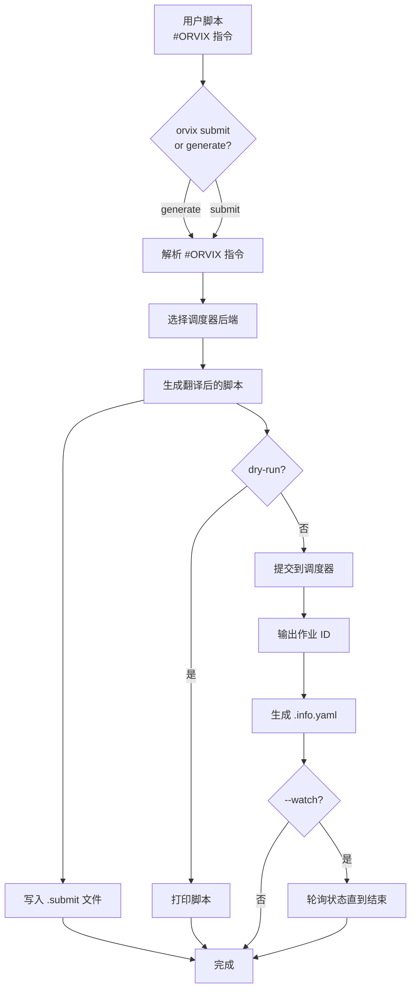

# orvix

orvix 是一个用于向 HPC 集群提交脚本作业的命令行工具。

只需在脚本头部使用统一的 `#ORVIX key=value` 语法编写资源需求，orvix 会自动将其转换为目标调度器（如 SLURM）的指令并提交作业。

## 安装

### 常规构建

在 Linux 上，可直接使用 Makefile 构建：

```bash
make build
```

构建成功后，将生成二进制文件 `bin/orvix`。

### 离线构建（Vendor 模式）

对于无法连接互联网的 HPC 环境，可以使用 vendor 模式进行离线编译：

**1. 在有网络的机器上准备 vendor 目录：**

```bash
cd repo/orvix
make vendor          # 将依赖下载到 vendor/ 目录
```

**2. 将代码连同 vendor/ 目录复制到目标 HPC：**

```bash
# 方式一：打包后上传
tar czf orvix.tar.gz repo/orvix/
# 在 HPC 上解压后编译

# 方式二：如果代码已存在于 HPC 但无法联网更新依赖
# 只需将 vendor/ 目录复制到 repo/orvix/ 下即可
```

**3. 在 HPC 上编译：**

```bash
cd repo/orvix
make build           # 自动检测 vendor/ 存在，使用 -mod=vendor
```

Makefile 会自动检测 `vendor/modules.txt` 是否存在，如果存在则自动添加 `-mod=vendor` 标志。

**其他常用目标：**

```bash
make vendor-clean    # 删除 vendor/ 目录
make test            # 运行单元测试（也会自动使用 vendor 模式）
make build-all       # 为所有平台交叉编译
```

## 快速开始

在脚本顶部添加 `#ORVIX` 指令：

```bash
#!/bin/bash
#ORVIX scheduler=slurm
#ORVIX queue=normal
#ORVIX job-name=demo
#ORVIX nodes=2
#ORVIX time=01:00:00
#ORVIX exclusive

echo "Hello from HPC"
```

使用 `orvix generate` 仅生成提交脚本（不提交）：

```bash
$ orvix generate myjob.sh
Generated: /abs/path/myjob.sh.submit
```

使用 `orvix submit` 提交脚本：

```bash
$ orvix submit myjob.sh
12345678
```

该命令会生成两个附属文件：

- `myjob.sh.submit`：翻译后的脚本，用于提交到作业队列
- `myjob.sh.info.yaml`：作业元数据，包含作业 ID

使用 `orvix status` 查看作业状态：

```bash
$ orvix status myjob.sh.info.yaml
RUNNING
```

使用 `orvix watch` 持续监视作业直到结束：

```bash
$ orvix watch myjob.sh.info.yaml
[2026-05-22T03:48:10Z] PENDING
[2026-05-22T03:48:15Z] RUNNING
[2026-05-22T03:50:20Z] COMPLETED
```

使用 `orvix kill` 终止作业：

```bash
$ orvix kill myjob.sh.info.yaml
```

一步完成提交和监视：

```bash
$ orvix submit --watch myjob.sh
12345678
[2026-05-22T03:48:10Z] PENDING
[2026-05-22T03:48:15Z] RUNNING
[2026-05-22T03:50:20Z] COMPLETED
```

## 工作流程



## 指令语法

`#ORVIX` 指令必须出现在脚本的初始注释块中（在第一个非空、非注释行之前）：

```bash
#!/bin/bash
#ORVIX scheduler=slurm
#ORVIX queue=normal
#ORVIX job-name=demo
#ORVIX nodes=2
#ORVIX time=01:00:00
#ORVIX comment="long running benchmark"
#ORVIX exclusive

set -euo pipefail
echo "running"
```

### 语法规则

| 语法 | 含义 |
|---|---|
| `#ORVIX key=value` | 带值的指令 |
| `#ORVIX key` | 无值指令（如布尔标志 `exclusive`） |
| `#ORVIX key="x y"` 或 `'x y'` | 包含空格的值必须用双引号或单引号包裹 |

注意事项：

- `#ORVIX` 必须为大写，`#` 后不能有空格。`# ORVIX`、`#orvix` 和 `#ORVIXFOO` 均会被忽略。
- 解析在第一个非空、非注释行处停止。
- 指令必须为 `key=value` 形式；`key value`（无 `=`）是错误。

### 常用指令

#### 调度器与标识

| 指令 | 说明 | 示例 |
|---|---|---|
| `scheduler` | 选择调度器后端（`slurm`、`donau` 或 `local`），默认 `local` | `scheduler=slurm` |
| `job-name` | 作业名称 | `job-name=myjob` |
| `queue` | 分区 / 队列 | `queue=normal` |

#### 计算资源

| 指令 | 说明 | 示例 |
|---|---|---|
| `nodes` | 节点数量 | `nodes=2` |
| `ntasks` | 任务总数 | `ntasks=4` |
| `ntasks-per-node` | 每节点任务数 | `ntasks-per-node=2` |
| `cpus-per-task` | 每任务 CPU 数 | `cpus-per-task=4` |
| `time` | 时间限制（`HH:MM:SS`） | `time=01:00:00` |
| `memory` | 内存需求 | `memory=16G` |
| `exclusive` | 独占节点访问 | `exclusive` |
| `nodelist` | 指定节点列表 | `nodelist=node[01-04]` |

#### I/O

| 指令 | 说明 | 示例 |
|---|---|---|
| `output` | 标准输出文件 | `output=job.out` |
| `error` | 标准错误文件 | `error=job.err` |

#### 作业控制

| 指令 | 说明 | 示例 |
|---|---|---|
| `account` | 计费账户 | `account=proj01` |
| `dependency` | 作业依赖 | `dependency=afterok:12345` |

#### 平台必填字段（CMA HPC）

| 指令 | 说明 | 示例 |
|---|---|---|
| `project` | 项目任务号，由 HPC 管理员提供 | `project=105-01-01` |
| `application` | 应用名称，由 HPC 管理员提供。使用 `modelname` 查看可用选项，如 `GRAPES`、`MCV` 等 | `application=GRAPES` |

### 后端条件指令

如果同一脚本在不同后端需要不同值，可使用 `[scheduler=<name>]` 条件前缀：

```bash
#ORVIX queue=normal
#ORVIX [scheduler=slurm] account=slurm_proj
#ORVIX [scheduler=donau] account=donau_proj
```

在上例中，`queue=normal` 适用于所有后端；`account` 的值根据当前后端选择。条件行可以覆盖之前同键的无条件指令。

## 命令

### `orvix generate [flags] <脚本>`

解析脚本中的 `#ORVIX` 指令，生成翻译后的脚本并写入 `.submit` 文件，**不提交**到调度器，也不生成 `.info.yaml`。

```bash
$ orvix generate case/job/serial/orvix_serial.sh
Generated: /abs/path/orvix_serial.sh.submit
```

选项：

```bash
orvix generate --scheduler=slurm script.sh            # 强制指定调度器后端
orvix generate --output-script=/tmp/submit.sh script.sh  # 自定义输出路径
```

### `orvix submit <脚本>`

解析脚本中的 `#ORVIX` 指令，生成翻译后的脚本并提交。

```bash
$ orvix submit case/job/serial/orvix_serial.sh
12345678
```

选项：

```bash
orvix submit --dry-run script.sh                    # 仅打印翻译后的脚本，不提交
orvix submit --scheduler=slurm script.sh            # 强制指定调度器后端，覆盖脚本中的设置
orvix submit --watch script.sh                      # 提交后持续轮询状态直到作业结束
orvix submit --watch --watch-interval=10s script.sh # 自定义轮询间隔（默认：5s）
```

### `orvix status <info.yaml>`

查询作业状态。

```bash
$ orvix status case/job/serial/orvix_serial.info.yaml
RUNNING
```

### `orvix watch [flags] <info.yaml>`

持续轮询作业状态，直到作业到达终止状态（COMPLETED、FAILED、CANCELLED、TIMEOUT）。

```bash
$ orvix watch case/job/serial/orvix_serial.info.yaml
[2026-05-22T10:00:00Z] PENDING
[2026-05-22T10:00:05Z] RUNNING
[2026-05-22T10:02:00Z] COMPLETED
```

选项：

```bash
orvix watch -i 10s case/job/serial/orvix_serial.info.yaml  # 每 10 秒轮询一次（默认：5s）
```

### `orvix kill <info.yaml>`

终止作业。

```bash
$ orvix kill case/job/serial/orvix_serial.info.yaml
```

## 生成的文件

### `orvix submit` 生成的文件

提交 `path/to/script.sh` 后，会在**同一目录**下创建以下文件：

```
path/to/script.sh              # 原始脚本（不变）
path/to/script.sh.submit       # 实际执行的翻译后脚本
path/to/script.sh.info.yaml    # 作业元数据（status / kill / watch 使用）
path/to/script.sh.submit.log   # 提交失败时的错误日志（仅失败时生成）
```

- 提交成功时，会生成 `.submit` 和 `.info.yaml`。
- 提交失败时（如解析错误、调度器拒绝），会额外生成 `.submit.log`，记录错误和时间戳。
- 重新提交会覆盖同名现有文件。

### `orvix generate` 生成的文件

`orvix generate` 仅生成 `.submit` 文件，**不**生成 `.info.yaml`：

```
path/to/script.sh              # 原始脚本（不变）
path/to/script.sh.submit       # 翻译后的脚本
```

适用于需要预生成脚本、手动检查后再提交的场景。

`info.yaml` 示例：

```yaml
scheduler: slurm
job_id: "12345678"
submitted_at: 2026-05-10T11:27:22.107722252Z
script_source: /abs/path/script.sh
script_generated: /abs/path/script.sh.submit
submit_dir: /abs/path
hostname: login01
user: wangdp
directives:
    - key: scheduler
      value: slurm
    - key: queue
      value: normal
    - key: nodes
      value: "2"
```

## 支持的调度器后端

| 后端 | 说明 |
|---|---|
| `slurm` | 转换为 `#SBATCH` 指令，通过 `sbatch` 提交到 SLURM 集群 |
| `donau` | 转换为 `#DSUB` 指令，通过 `dsub` 提交到华为 Donau 调度系统 |
| `local` | 作为本地子进程直接运行，适用于本地测试 |

### SLURM 指令映射

使用 `scheduler=slurm` 时，orvix 指令到 SLURM 指令的映射如下：

| orvix 指令 | SLURM 指令 | 说明 |
|---|---|---|
| `job-name` | `--job-name` | 作业名称 |
| `output` | `--output` | 标准输出文件 |
| `error` | `--error` | 标准错误文件 |
| `nodes` | `--nodes` | 节点数量 |
| `ntasks` | `--ntasks` | 任务总数 |
| `ntasks-per-node` | `--ntasks-per-node` | 每节点任务数 |
| `cpus-per-task` | `--cpus-per-task` | 每任务 CPU 数 |
| `time` | `--time` | 时间限制（`HH:MM:SS`） |
| `queue` | `--partition` | 分区 / 队列 |
| `account` | `--account` | 计费账户 |
| `project` | `--wckey` | 项目任务号 |
| `application` | `--comment` | 应用名称 |
| `exclusive` | `--exclusive` | 独占节点访问 |
| `nodelist` | `--nodelist` | 指定节点列表 |
| `memory` | `--mem` | 内存需求 |
| `dependency` | `--dependency` | 作业依赖 |

### Donau 指令映射

使用 `scheduler=donau` 时，orvix 指令到 Donau 指令的映射如下：

| orvix 指令 | Donau 指令 | 说明 |
|---|---|---|
| `job-name` | `-n` | 作业名称 |
| `output` | `-oo` | 标准输出文件 |
| `error` | `-eo` | 标准错误文件 |
| `nodes` | `-nn` | 节点数量 |
| `ntasks-per-node` | `-tpn` | 每节点任务数 |
| `cpus-per-task` | `-R "cpu=X"` | 每任务 CPU 数（与 `memory` 合并为一条 `-R` 指令） |
| `memory` | `-R "mem=Y"` | 内存需求（与 `cpus-per-task` 合并为一条 `-R` 指令） |
| `time` | `-T` | 时间限制（`HH:MM:SS` 自动转换为秒；时长字符串如 `8h` 原样传递） |
| `queue` | `-q` | 队列 |
| `account` | `-A` | 账户 |
| `project` | `-d` | 项目号（与 `application` 合并为 `-d "project:application"`） |
| `application` | `-d` | 应用名称（与 `project` 合并为 `-d "project:application"`） |
| `exclusive` | `--exclusive` | 独占节点访问（可带值或不带值） |
| `nodelist` | `-pn` | 指定节点列表（自动加引号） |
| `job-type` | `--job_type` | 作业类型 |

注意：`ntasks` 和 `dependency` 在 Donau 中无对应指令，会被静默忽略。

## 许可证

orvix 基于 [Apache License, Version 2.0](https://www.apache.org/licenses/LICENSE-2.0) 授权。
