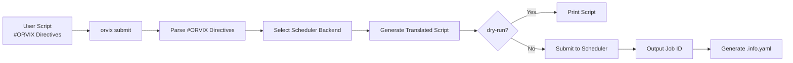

# orvix

orvix is a command-line tool for submitting script jobs to HPC clusters.

Simply write resource requirements in your script header using the unified `#ORVIX key=value` syntax, and orvix will automatically translate them into directives for the target scheduler (e.g., SLURM) and submit the job.

## Installation

On Linux, build directly with the Makefile:

```bash
make build
```

On success, the binary `bin/orvix` is generated. Add it to your `PATH` for convenience.

## Quick Start

Add `#ORVIX` directives to the top of your script:

```bash
#!/bin/bash
#ORVIX scheduler=slurm
#ORVIX queue=normal
#ORVIX job-name=demo
#ORVIX nodes=2
#ORVIX time=01:00:00
#ORVIX exclusive

echo "Hello from HPC"
```

Submit the script with `orvix submit`:

```bash
$ orvix submit myjob.sh
12345678
```

This command creates two sidecar files:

- `myjob.sh.submit`: the translated script submitted to the job queue
- `myjob.sh.info.yaml`: job metadata, including the job ID

Check job status with `orvix status`:

```bash
$ orvix status myjob.sh.info.yaml
RUNNING
```

Kill the job with `orvix kill`:

```bash
$ orvix kill myjob.sh.info.yaml
```

## Workflow



## Directive Syntax

`#ORVIX` directives must appear in the initial comment block of the script (before the first non-blank, non-comment line):

```bash
#!/bin/bash
#ORVIX scheduler=slurm
#ORVIX queue=normal
#ORVIX job-name=demo
#ORVIX nodes=2
#ORVIX time=01:00:00
#ORVIX comment="long running benchmark"
#ORVIX exclusive

set -euo pipefail
echo "running"
```

### Syntax Rules

| Syntax | Meaning |
|---|---|
| `#ORVIX key=value` | Directive with a value |
| `#ORVIX key` | Valueless directive (e.g., boolean flags like `exclusive`) |
| `#ORVIX key="x y"` or `'x y'` | Values containing spaces must be wrapped in double or single quotes |

Notes:

- `#ORVIX` must be uppercase with no space after `#`. `# ORVIX`, `#orvix`, and `#ORVIXFOO` are all ignored.
- Parsing stops at the first non-blank, non-comment line.
- Directives must be in `key=value` form; `key value` (without `=`) is an error.

### Common Directives

#### Scheduler & Identity

| Directive | Description | Example |
|---|---|---|
| `scheduler` | Select scheduler backend (`slurm` or `local`), default `local` | `scheduler=slurm` |
| `job-name` | Job name | `job-name=myjob` |
| `queue` | Partition / queue | `queue=normal` |

#### Compute Resources

| Directive | Description | Example |
|---|---|---|
| `nodes` | Number of nodes | `nodes=2` |
| `ntasks` | Total number of tasks | `ntasks=4` |
| `ntasks-per-node` | Tasks per node | `ntasks-per-node=2` |
| `cpus-per-task` | CPUs per task | `cpus-per-task=4` |
| `time` | Time limit (`HH:MM:SS`) | `time=01:00:00` |
| `memory` | Memory requirement | `memory=16G` |
| `exclusive` | Exclusive node access | `exclusive` |
| `nodelist` | Specific node list | `nodelist=node[01-04]` |

#### I/O

| Directive | Description | Example |
|---|---|---|
| `output` | Standard output file | `output=job.out` |
| `error` | Standard error file | `error=job.err` |

#### Job Control

| Directive | Description | Example |
|---|---|---|
| `account` | Billing account | `account=proj01` |
| `dependency` | Job dependency | `dependency=afterok:12345` |

#### Platform-Required Fields (CMA HPC)

| Directive | Description | Example |
|---|---|---|
| `project` | Project task number, provided by the HPC administrator | `project=105-01-01` |
| `application` | Application name, provided by the HPC administrator. Use `modelname` to see available options, e.g., `GRAPES`, `MCV`, etc. | `application=GRAPES` |

### Backend-Conditional Directives

If the same script needs different values for different backends, use the `[scheduler=<name>]` conditional prefix:

```bash
#ORVIX queue=normal
#ORVIX [scheduler=slurm] account=slurm_proj
#ORVIX [scheduler=donau] account=donau_proj
```

In the example above, `queue=normal` applies to all backends; the `account` value is selected based on the active backend. Conditional lines can override an earlier unconditional directive with the same key.

## Commands

### `orvix submit <script>`

Parse `#ORVIX` directives in the script, generate the translated script, and submit it.

```bash
$ orvix submit case/job/serial/orvix_serial.sh
12345678
```

Options:

```bash
orvix submit --dry-run script.sh           # Only print the translated script, do not submit
orvix submit --scheduler=slurm script.sh   # Force a scheduler backend, overriding the script setting
```

### `orvix status <info.yaml>`

Query the job status.

```bash
$ orvix status case/job/serial/orvix_serial.info.yaml
RUNNING
```

### `orvix kill <info.yaml>`

Kill the job.

```bash
$ orvix kill case/job/serial/orvix_serial.info.yaml
```

## Generated Files

After submitting `path/to/script.sh`, the following files are created in the **same directory**:

```
path/to/script.sh              # original script (unchanged)
path/to/script.sh.submit       # translated script actually executed
path/to/script.sh.info.yaml    # job metadata (used by status / kill)
path/to/script.sh.submit.log   # error log on submission failure (only on failure)
```

- On successful submission, `.submit` and `.info.yaml` are generated.
- On submission failure (e.g., parse error, scheduler rejection), an additional `.submit.log` is created recording the error and timestamp.
- Resubmitting overwrites existing files with the same names. If the script has no extension, `.sh` is appended by default.

Example `info.yaml`:

```yaml
scheduler: slurm
job_id: "12345678"
submitted_at: 2026-05-10T11:27:22.107722252Z
script_source: /abs/path/script.sh
script_generated: /abs/path/script.sh.submit
submit_dir: /abs/path
hostname: login01
user: wangdp
directives:
    - key: scheduler
      value: slurm
    - key: queue
      value: normal
    - key: nodes
      value: "2"
```

## Supported Scheduler Backends

| Backend | Description |
|---|---|
| `slurm` | Translates to `#SBATCH` directives and submits via `sbatch` to a SLURM cluster |
| `local` | Runs directly as a local subprocess, useful for local testing |

### SLURM Directive Mapping

When using `scheduler=slurm`, the mapping from orvix directives to SLURM directives is:

| orvix Directive | SLURM Directive | Description |
|---|---|---|
| `job-name` | `--job-name` | Job name |
| `output` | `--output` | Standard output file |
| `error` | `--error` | Standard error file |
| `nodes` | `--nodes` | Number of nodes |
| `ntasks` | `--ntasks` | Total number of tasks |
| `ntasks-per-node` | `--ntasks-per-node` | Tasks per node |
| `cpus-per-task` | `--cpus-per-task` | CPUs per task |
| `time` | `--time` | Time limit (`HH:MM:SS`) |
| `queue` | `--partition` | Partition / queue |
| `account` | `--account` | Billing account |
| `project` | `--wckey` | Project task number |
| `application` | `--comment` | Application name |
| `exclusive` | `--exclusive` | Exclusive node access |
| `nodelist` | `--nodelist` | Specific node list |
| `memory` | `--mem` | Memory requirement |
| `dependency` | `--dependency` | Job dependency |

## License

orvix is licensed under the [Apache License, Version 2.0](https://www.apache.org/licenses/LICENSE-2.0).
